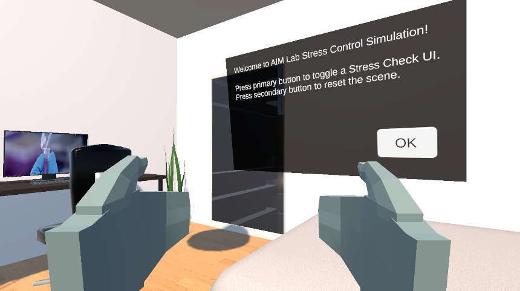
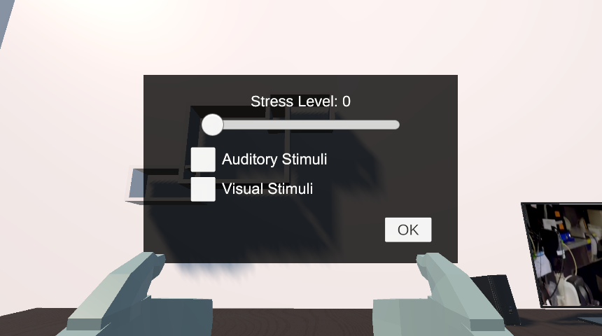
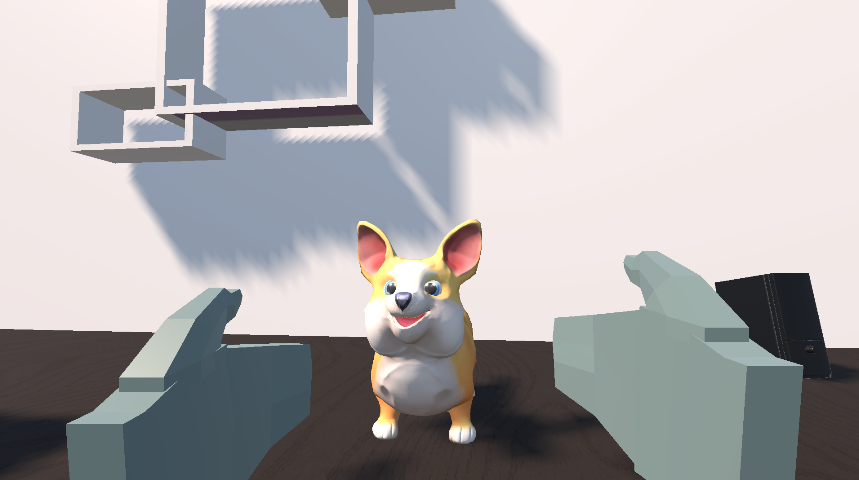
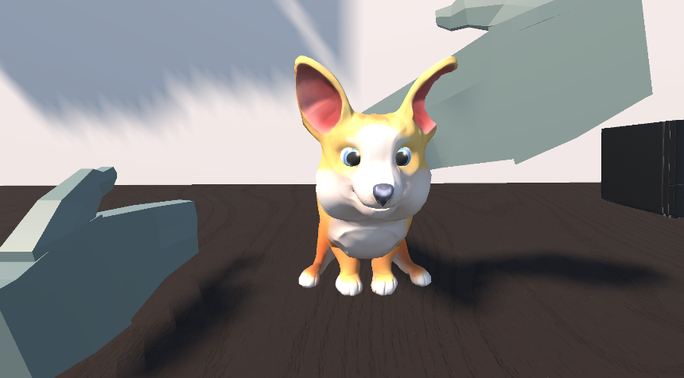
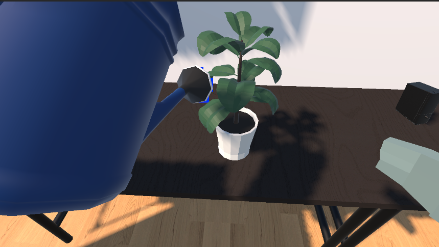
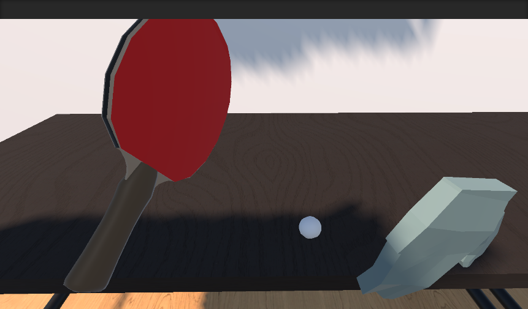

# Immerisve XR for Stress Regulation

### A VR environment for exploring emotion regulation

Immerisve XR for Stress Regulation brings music, imagery, and everyday activities into a virtual room. Users can rate their stress, choose an activity, and spend time with a virtual dog, a ping-pong paddle, or a plant and watering can. The project explores how a shared environment can offer different ways to engage with one's emotional state through sensory experiences and interaction.

*Start window*

## The experience

Users choose what to engage with and can switch activities at their own pace.

| Feature | What users can do |
| --- | --- |
| **Stress checker** | Enter a current stress rating from 0 to 100 using a slider. **TODO: use ECG data.** |
| **Music** | Listen to a looping track selected according to the current stress rating. |
| **Images** | View a movable image panel and cycle through tree, marshmallow, and rain images. |
| **Virtual dog** | Pet a corgi and use hand gestures to prompt paw and barking responses, with animation and sound feedback. |
| **Ping-pong** | Pick up a paddle and interact with a ball, with collision sounds. |
| **Plant watering** | Pick up and tilt a watering can to pour water, accompanied by water particles and sound. |
| **Textile vest** | **TODO:** integrate a textile vest into the experience. |

The **Pet**, **Sports**, and **Planting** toggles bring the corresponding objects into the room. The stress panel can be reopened at any point to enter a new rating.

### Stress checker

Users enter their current stress level on a 0–100 slider. The displayed rating updates as the slider moves and determines which track plays when music is enabled.

*Stress checker*

**TODO:** use ECG data as an input to the stress checker. The current version uses manual ratings.

### Music and imagery

Music selection uses three stress ranges:

| Stress rating | Track |
| --- | --- |
| Below 30 | Mendelssohn — *A Midsummer Night's Dream* |
| 30 to below 60 | Chopin — *Funeral March* |
| 60–100 | Chopin — *Étude Op. 25 No. 11 (Winter Wind)* |

The track is selected when music is enabled. After changing the stress rating, turn music off and on to apply the new selection. These associations are an initial design choice for the prototype.

Images are selected manually. Enable the image panel, grab it, and press the controller trigger to cycle to the next image.

*Suggested image: The image panel in the room, with small previews of the three available images beside it.*

### Pet interactions

Enable **Pet** to bring the corgi into the room. The dog responds directly to hand contact and gestures.

- **Petting:** bring either virtual hand into the dog's petting area. The corgi responds with a petting animation and sound. Moving the hand away ends the sound and returns the dog to its idle pose.
- **Give a paw:** bring the left hand into the paw interaction area and adjust its orientation to prompt the paw animation. Moving the hand out of the area returns the dog to idle.
- **Bark:** bring the right hand into the barking interaction area and adjust its orientation to prompt a bark animation and sound. Moving the hand away stops the sound and returns the dog to idle.

The paw and barking gestures depend on both proximity and hand orientation. Keep the hand close to the dog and rotate it gradually to find the gesture. No grip or trigger press is needed for these responses.

Disabling **Pet** hides the dog. Toggling the activity also restores it to its starting position.

| Dog | Dog petting |
| --- | --- |
|  |  |

### Plant watering and sports

| Watering plant | Sports |
| --- | --- |
|  |  |

## Try it

1. Clone or download the repository.
2. Add the project folder in **Unity Hub** and open it with **Unity 2022.3.33f1**.
3. Wait for Unity to import the assets and packages.
4. Open `Assets/Scenes/AIM Lab.unity`.
5. Press **Play**, then click inside the **Game** window.

### VR headset and controllers

Connect your headset to the computer and start its PC VR software. In Unity's Hierarchy, expand **-- XR --** and disable **XR Device Simulator** using the checkbox beside its name in the Inspector. Enter Play mode to use the headset and controllers.

Use the controller grip to pick up objects and the trigger to press UI buttons or activate a held object. Hold the primary button to point at menus. The secondary button opens the stress panel and lets you stand up when seated.

*Suggested image: A labeled photo or diagram of the controllers used for the demo, identifying the grip, trigger, primary button, and secondary button.*

| Action | VR controller | Keyboard and mouse |
| --- | --- | --- |
| Look around | Turn your head | Hold right mouse button and move the mouse in rotation mode |
| Position the right / left hand | Move the corresponding controller | Hold Space / Left Shift and move the simulated hand |
| Grab an object | Grip while touching the object | G while controlling a hand in contact with the object |
| Press UI or activate a held object | Trigger | Left mouse button |
| Show the pointing ray | Hold the primary button | Hold B while controlling a hand |
| Open the stress panel / stand up | Secondary button | N while controlling a hand |

**To sit in VR:** release the primary button, reach toward the chair's seat, and squeeze the grip while the virtual hand touches it. Release the grip after sitting. Press the secondary button to stand up.

**To interact with the dog:** move your controllers to pet the dog or perform the left-hand paw and right-hand barking gestures described above.

### Keyboard and mouse

Enable **XR Device Simulator** under **-- XR --** in the Hierarchy, enter Play mode, and click inside the **Game** window.

Hold **Space** to control the right hand or **Left Shift** to control the left hand. Grip and trigger inputs act on that hand.

| Input | Action |
| --- | --- |
| Right mouse button + mouse movement | Look around in rotation mode |
| Space / Left Shift, held | Control the right / left hand |
| Y / T | Toggle right / left hand control without holding |
| W / A / S / D | Move the controlled device |
| Q / E | Move it down / up in position mode |
| R | Switch mouse movement between moving and rotating the device |
| G | Grip or grab |
| Left mouse button | Trigger: press UI or activate a held object |
| B, held | Show the hand's pointing ray |
| N | Open the stress panel and stand up if seated |
| Backslash (`\`) | Lock or unlock the cursor |

**To enter a stress rating:** hold **Space** and press **N**. The stress panel appears with a slider near the top. Hold **Space + B**, point at the slider, then hold the left mouse button and move the pointer to adjust it. Select **OK** to close the panel.

**To sit:** release **B**, hold **Space**, and move the virtual hand into contact with the office chair's seat. Press **G** while touching it, then release the grip once seated. Hold **Space** and press **N** to stand up. The chair requires hand contact; pointing at it from a distance will not seat the player.

**To water the plant:** enable **Planting**, move a hand to the watering can, and hold **G** to grab it. Rotate the hand to tilt the can and start pouring.

For a first visit, enter a stress rating, try the music or images, and then explore one of the physical activities. Dog gestures and ping-pong take more practice with a mouse because each hand must be positioned separately.
